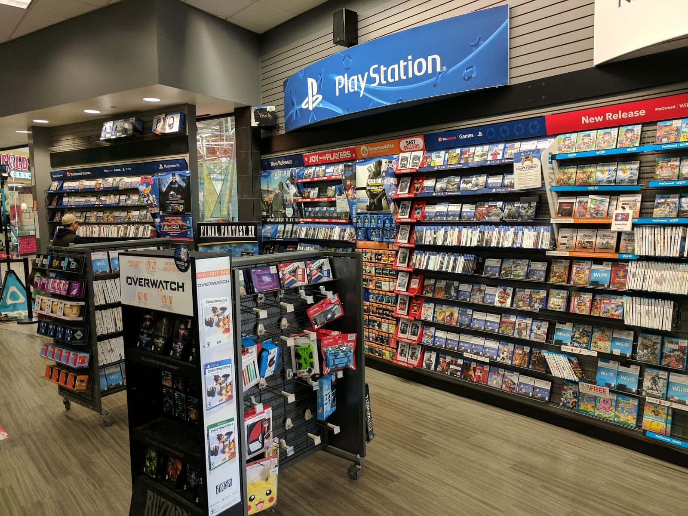

# game-station

# Introduction

[https://github.com/vietphan1995/game-station.git](https://github.com/vietphan1995/game-station.git)

Game Station is a software platform act as start page of gamer, this platform stores and indexes all of game titles in many platforms, many devices with contents follow, also bring best experience on your game devices.

Game Station provides more game title contents like experience, demo, trailer videos, news, release/publish notes, events, promotion, … with notification in platform, in mailbox, …

Game Station suggests game titles fit with your interesting, experience, goes with provider information like store, market channel.

Game Station manages fan page for game company, artists, agency, game influencers. Game Station manages gaming livestream, push game social fan, game creator from these fan pages.

[back to projects …](https://github.com/vietphan1995/projects)

### Notes
https://six-zinc-ad4.notion.site/game-station-1b25e832d6ee80f1ae6cc5868049b8e0